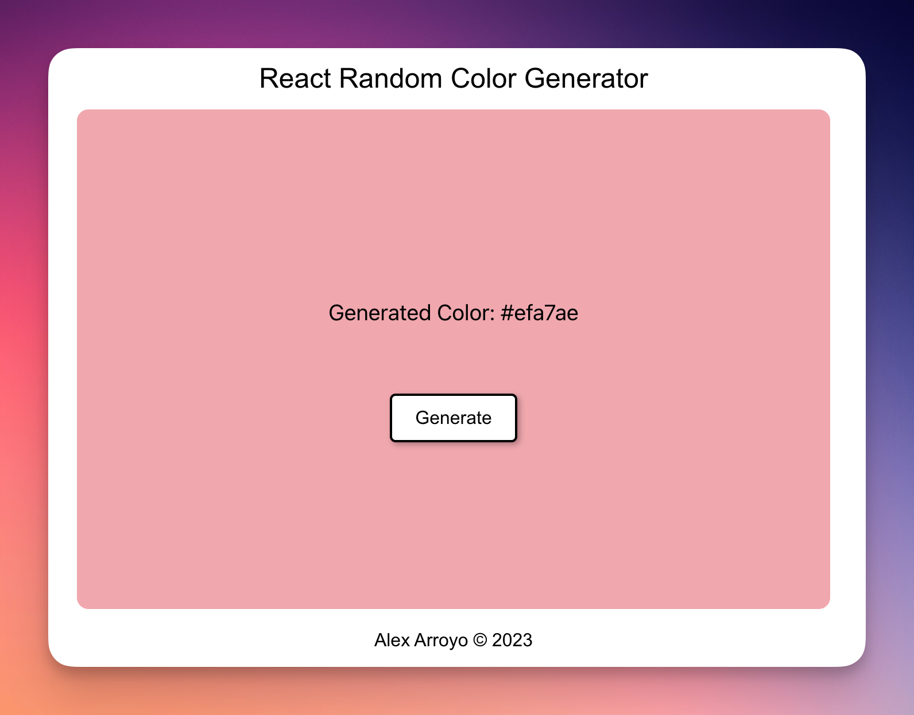

# React Random Color Generator

Web application that generates a random color each time you press the "Generate" button.

## Features

- App shows a random color when a button is clicked.
- Once the color is generated, the background color of the div containing the text `Generated Color: <background color hex code>` gets updated with sai`d color.

## Used Technologies and Libraries

- React
- styled-components
- randomcolor

### Live: [Try it out](https://reactrandomcolorgenerator.netlify.app/)

---

Alex Arroyo © 2023
